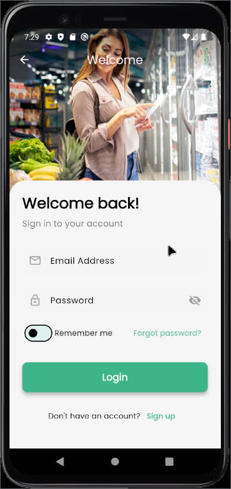
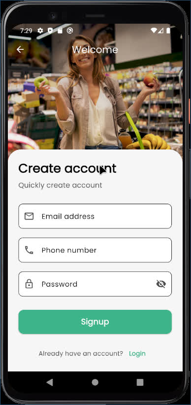
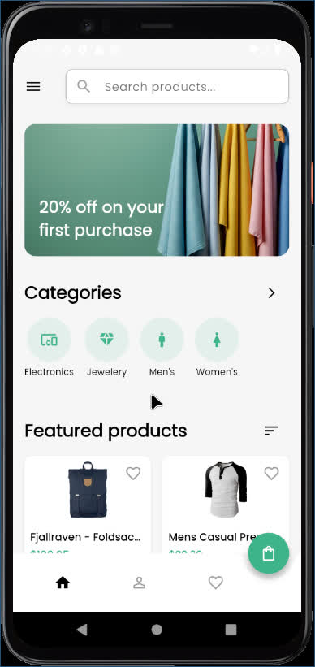
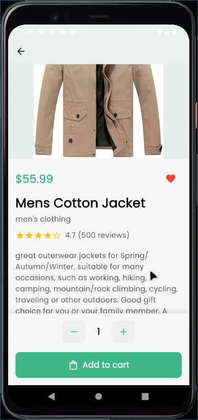
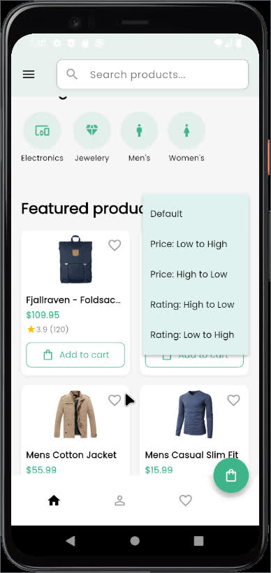
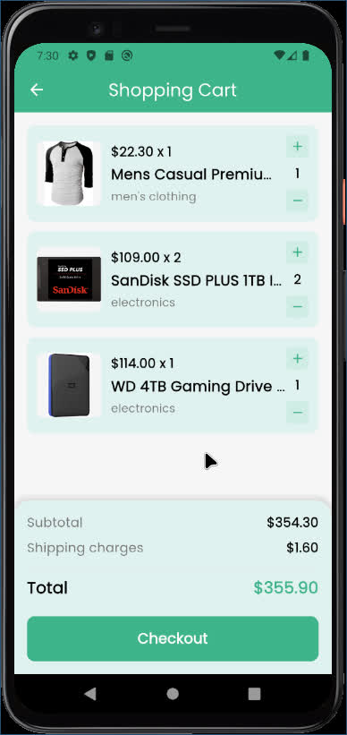
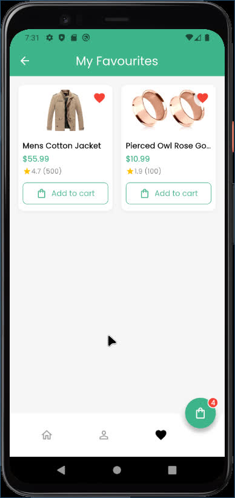
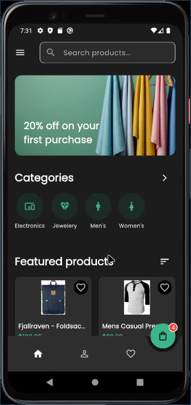
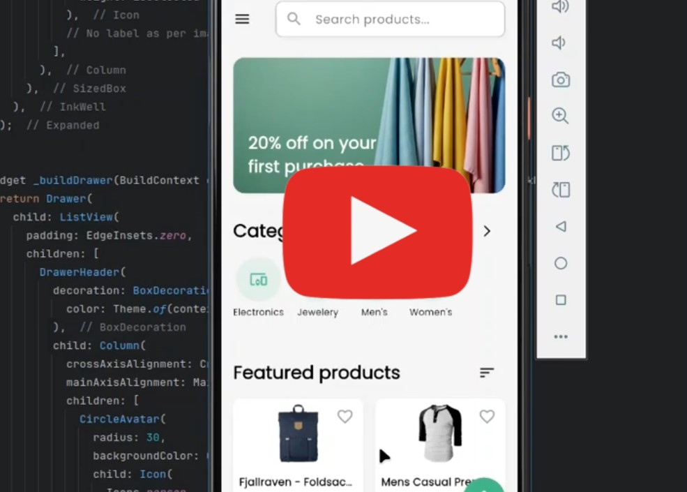

# SmartShop - A Modern E-commerce Mobile App

## Table of Contents

* [About SmartShop](#about-smartshop)
* [Features](#features)
* [Screenshots](#screenshots)
* [Video Demo](#video-demo)
* [Technologies Used](#technologies-used)
* [Installation](#installation)
* [Usage](#usage)
* [Contributing](#contributing)
* [License](#license)

## About SmartShop

SmartShop is a modern, feature-rich e-commerce mobile application built with Flutter. It's designed to provide a seamless and intuitive shopping experience, showcasing a clean UI/UX, dynamic product listings, and essential e-commerce functionalities. The app fetches product data from the [FakeStoreAPI](https://fakestoreapi.com/) to simulate a real-world product catalog.

This project demonstrates best practices in Flutter development, including state management with Provider, custom theming for light/dark modes, robust navigation, and efficient data handling.

## Features

* **Authentication:** Polished Login and Registration screens with input validation and subtle gradient overlays.
* **Dynamic Product Listing:** Browse a wide range of products with infinite scrolling (simulated).
* **Product Sorting:** Sort products by price (low to high, high to low) and rating (high to low, low to high).
* **Category Browsing:** View products filtered by specific categories.
* **Detailed Product Pages:** Comprehensive product view including large images, price, ratings, description, and a quantity selector.
* **Persistent Bottom Bar:** "Add to Cart" and quantity controls are always visible at the bottom of the product detail page for easy access.
* **Interactive Shopping Cart:**
    * Add/remove items and adjust quantities.
    * Swipe-to-delete functionality for cart items.
    * Dynamic badge on the cart icon showing item count.
* **Favorites Management:** Mark and view your favorite products in a dedicated "My Favourites" section.
* **User Profile:** A "My Profile" page for displaying user details and managing password changes.
* **Global Theming:** Full support for Light and Dark modes, leveraging Flutter's theming system and a custom `AppTheme` with the elegant Poppins font.
* **Responsive UI:** Adapts gracefully to different screen sizes and orientations.

## Screenshots

  




## Video Demo

See SmartShop in action! Watch a full walkthrough of the app's features and user experience on YouTube:

[](https://www.youtube.com/watch?v=g34eJb964_8)

## Technologies Used

* **Framework:** Flutter
* **Language:** Dart
* **State Management:** Provider
* **API:** FakeStoreAPI (for product and category data)
* **Font:** Google Fonts (Poppins)
* **Local Storage:** `shared_preferences` (for login state, if implemented)
* **HTTP Requests:** `http` package

## Installation

To get a local copy up and running, follow these simple steps.

### Prerequisites

* Flutter SDK installed (version 3.x.x or higher recommended)
* Android Studio / VS Code with Flutter and Dart plugins
* A physical device or emulator for testing

### Steps

1.  **Clone the repository:**
    ```bash
    git clone [https://github.com/hasanraj3100/SmartShop-Flutter.git](https://github.com/hasanraj3100/SmartShop-Flutter.git)
    cd SmartShop-Flutter
    ```

2.  **Install dependencies:**
    ```bash
    flutter pub get
    ```

3.  **Update Android NDK Version (if prompted):**
    If you encounter an NDK version mismatch error during build, open `android/app/build.gradle.kts` and set `ndkVersion` to the highest version specified in the error message. For example:
    ```kotlin
    android {
        # ... other configurations
        ndkVersion = "27.0.12077973" # Use the version from your error message
    }
    ```
    Then run `flutter clean` and `flutter pub get` again.

4.  **Run the app:**
    ```bash
    flutter run
    ```

## Usage

* **Login/Register:** Use `user@example.com` / `1234` or `raj@example.com` / `12341234` for testing, or create a new account.
* **Browse Products:** Scroll through the home screen to see featured products.
* **Sort Products:** Use the sort icon on the home screen to sort by price or rating.
* **Explore Categories:** Tap "Categories" to view all available categories and filter products.
* **View Product Details:** Tap on any product tile to see its detailed page.
* **Add to Cart:** Adjust quantity and add products to your shopping cart.
* **Manage Cart:** Go to the cart page to review items, change quantities, or swipe to remove.
* **Favorites:** Tap the heart icon on any product to add/remove it from your favorites.
* **Toggle Theme:** Use the drawer menu to switch between Light and Dark modes.

## Contributing

Contributions are what make the open-source community such an amazing place to learn, inspire, and create. Any contributions you make are **greatly appreciated**.

If you have a suggestion that would make this better, please fork the repo and create a pull request. You can also simply open an issue with the tag "enhancement".
Don't forget to give the project a star! Thanks again!

1.  Fork the Project
2.  Create your Feature Branch (`git checkout -b feature/AmazingFeature`)
3.  Commit your Changes (`git commit -m 'Add some AmazingFeature'`)
4.  Push to the Branch (`git push origin feature/AmazingFeature`)
5.  Open a Pull Request

## License

Distributed under the MIT License. See `LICENSE` for more information.
